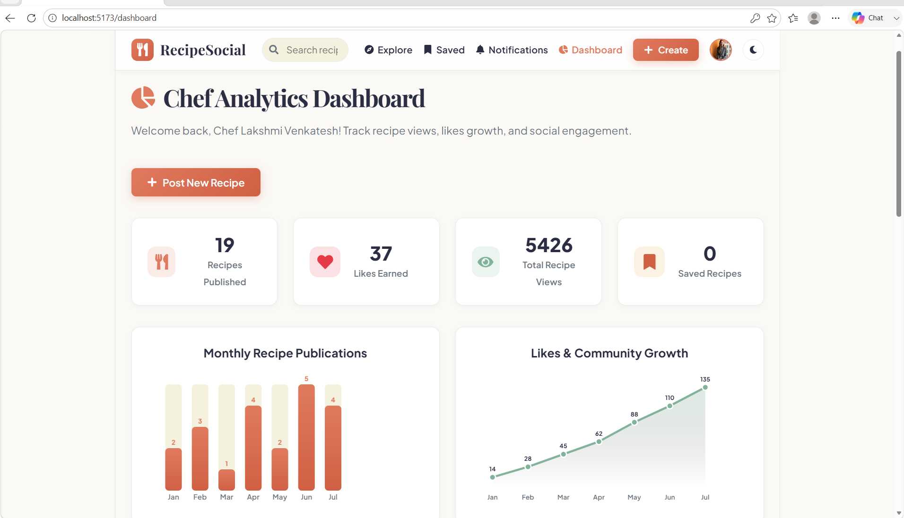
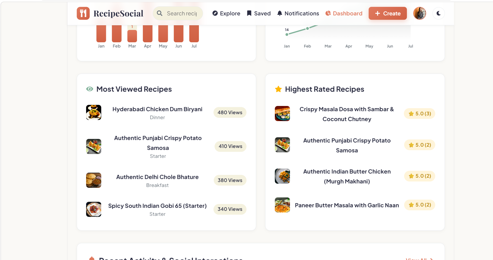
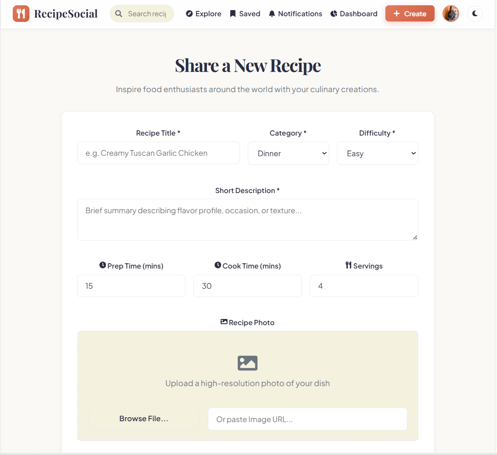
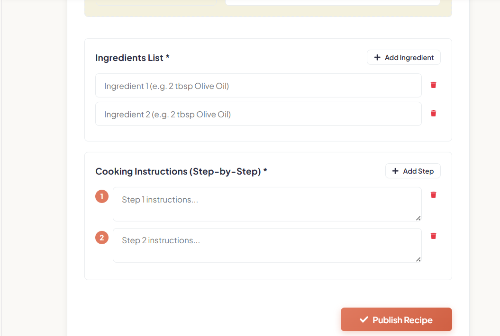
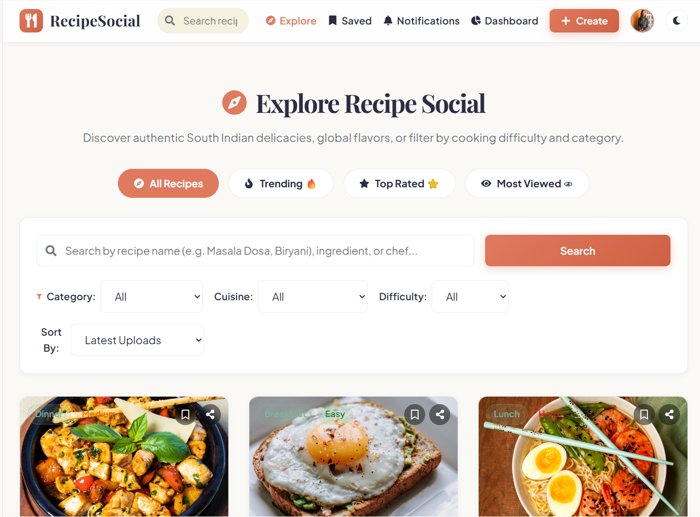
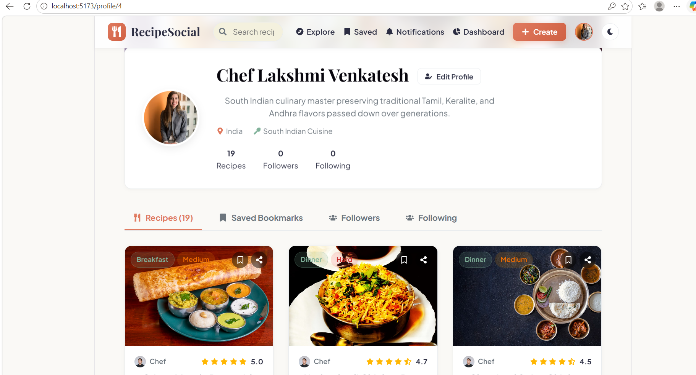
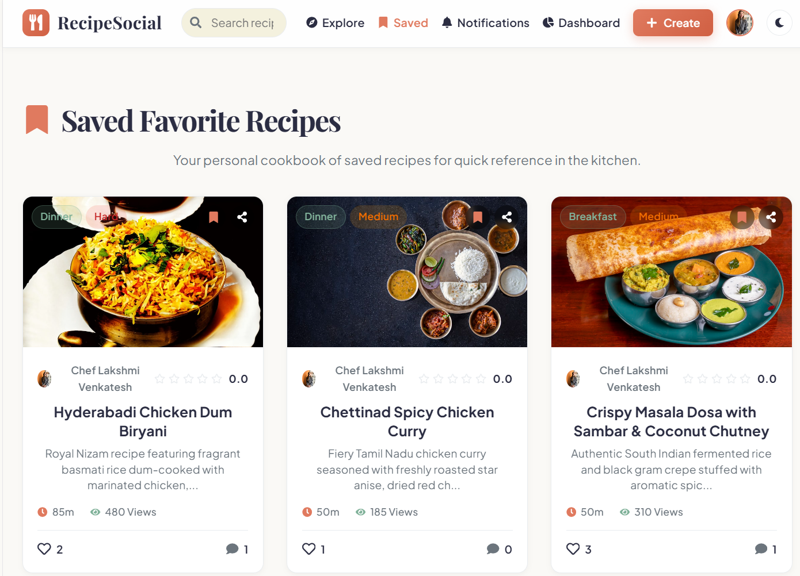

Intern ID: CITS7564
Full Name:Donthu Bhavya Sri
No. of Weeks: 8 Weeks
Project Name: Recipe Social Network


# 🍳 Recipe Social Network

A modern, feature-rich, full-stack web application designed for food lovers, home cooks, and professional chefs to share, discover, rate, and save culinary recipes.

Built with **React (Vite)** on the frontend, **Node.js & Express** on the backend, and **Dual Database Engine (MySQL with SQLite automatic fallback)**.

---

## ✨ Features

- **🌐 Interactive Explore & Feed**: Search recipes by title, ingredients, cuisine, or category with real-time filters and pagination.
- **📷 100% Verified Local Recipe Images**: All 60 curated recipes feature 100% locally served high-definition images in `/uploads` with zero broken external links.
- **👨‍🍳 Chef Profiles & Social Network**: User profiles featuring custom profile images, cover photos, bio, country of origin, favorite cuisine, and follower counts.
- **❤️ Social Interactions**:
  - **Likes & Bookmarks**: Save favorite recipes to personal collections.
  - **Ratings & Reviews**: Rate recipes (1 to 5 stars) with average score calculations.
  - **Comments**: Real-time comment threads on every recipe.
  - **Follow System**: Follow your favorite chefs and track their latest creations.
- **📅 Meal Planner & Shopping List**: Organize weekly meals and generate shopping lists directly from recipe ingredients.
- **🔐 Secure Authentication**: JWT token-based authentication with encrypted passwords (`bcryptjs`).
- **🔄 Dual Database Support**: Automatically connects to MySQL if available, with a seamless zero-config fallback to an embedded SQLite database (`recipe_social.db`).

---

## 🛠️ Tech Stack

### Frontend
- **Framework**: React 18+ (Vite)
- **Styling**: Vanilla CSS3 + Modern Glassmorphism & Micro-animations
- **State & Router**: React Router DOM v6
- **Icons**: Lucide React Icons

### Backend
- **Runtime**: Node.js
- **Framework**: Express v5
- **Authentication**: JSON Web Tokens (`jsonwebtoken`) & `bcryptjs`
- **File Storage**: Multer & Static File Serving (`/uploads`)
- **Database Layer**: `mysql2` (MySQL) & `sqlite` / `sqlite3` (SQLite)

---

## 🚀 Quick Start Guide

### Prerequisites
- [Node.js](https://nodejs.org/) (v18 or higher recommended)
- [npm](https://www.npmjs.com/)

---

### 1. Setup & Run Backend

```bash
# Navigate to backend directory
cd backend

# Install dependencies
npm install

# (Optional) Environment Configuration
# Edit .env file if customizing MySQL credentials:
# DB_HOST=localhost
# DB_USER=root
# DB_PASSWORD=
# DB_NAME=recipe_social_db
# PORT=5000

# Seed & Sync Database (MySQL / SQLite)
node sync_database.js

# Start backend server
npm run dev
# or
node server.js
```
> The backend server will start on `http://localhost:5000`.

---

### 2. Setup & Run Frontend

```bash
# Open a new terminal and navigate to frontend directory
cd frontend

# Install dependencies
npm install

# Start Vite dev server
npm run dev
```
> The frontend app will be accessible at `http://localhost:5173`.

---

## chef dashboard



## recipe publish page



## recipe


## profile 


## saved 

---

## 📂 Project Structure

```
Recipe Social Network/
├── backend/
│   ├── config/
│   │   ├── db.js              # Database connection & SQLite fallback handler
│   │   ├── schema.sql         # MySQL database schema definition
│   │   └── seed.sql           # Master SQL seed script (60 recipes + demo data)
│   ├── controllers/           # API Request logic controllers
│   ├── middleware/            # JWT Auth & Upload middleware
│   ├── routes/                # Express API routes
│   ├── uploads/               # Statically served recipe & user photos
│   ├── server.js              # Express app entry point
│   └── sync_database.js       # Atomic database synchronization & seeding script
│
├── frontend/
│   ├── public/                # Static public assets
│   ├── src/
│   │   ├── components/        # UI Components (Navbar, RecipeCard, Modals)
│   │   ├── context/           # AuthContext & State management
│   │   ├── pages/             # App Pages (Explore, RecipeDetail, Profile, Planner)
│   │   ├── App.jsx            # Main Router setup
│   │   └── index.css          # Core Design System & Tokens
│   ├── package.json
│   └── vite.config.js
│
├── DOCUMENTATION.md           # Comprehensive Technical Documentation & API Specs
└── README.md                  # Project overview & setup guide
```

---

## 📖 Complete Documentation

For detailed technical specifications, database schema definitions, API endpoint documentation, and architecture diagrams, check out [DOCUMENTATION.md](file:///c:/Users/bhavy/Desktop/Recipe%20Social%20Network/DOCUMENTATION.md).

---

## 📝 License

This project is open-source and available under the [ISC License](LICENSE).
